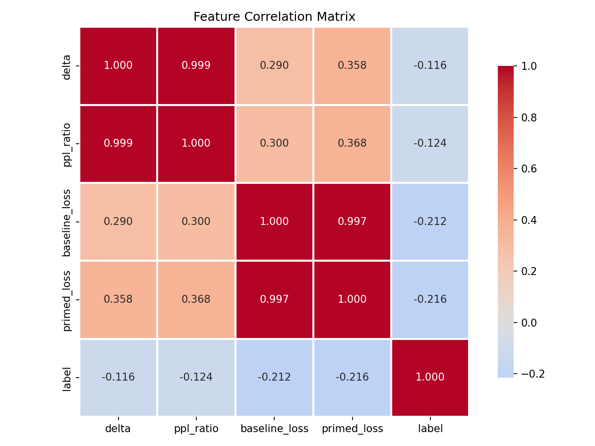
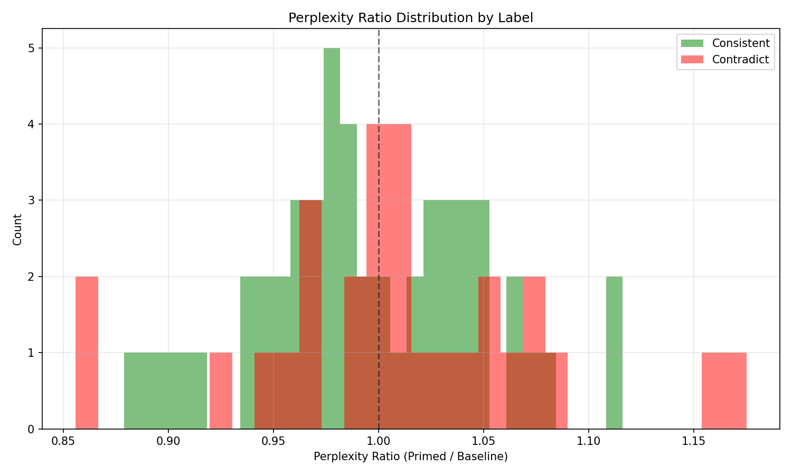
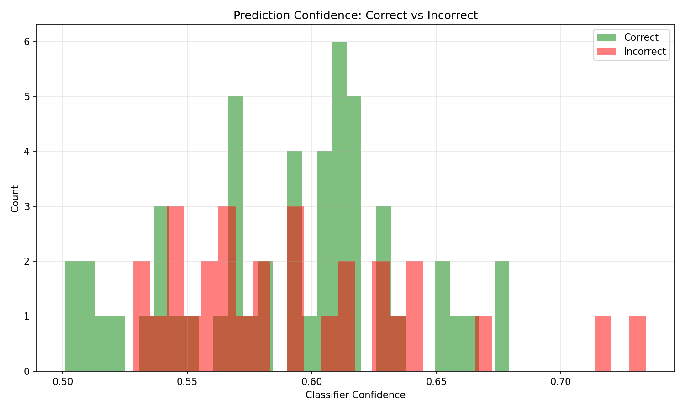
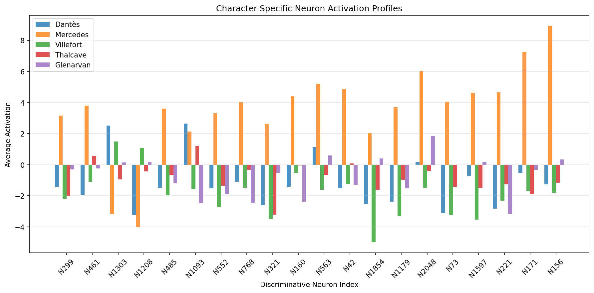
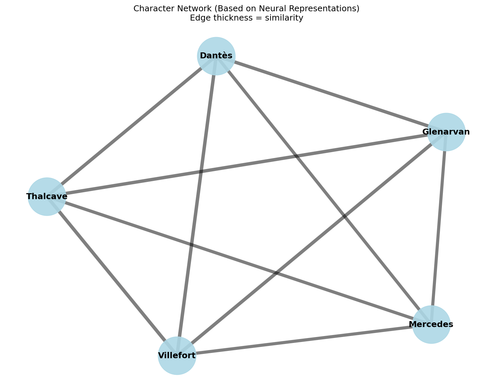
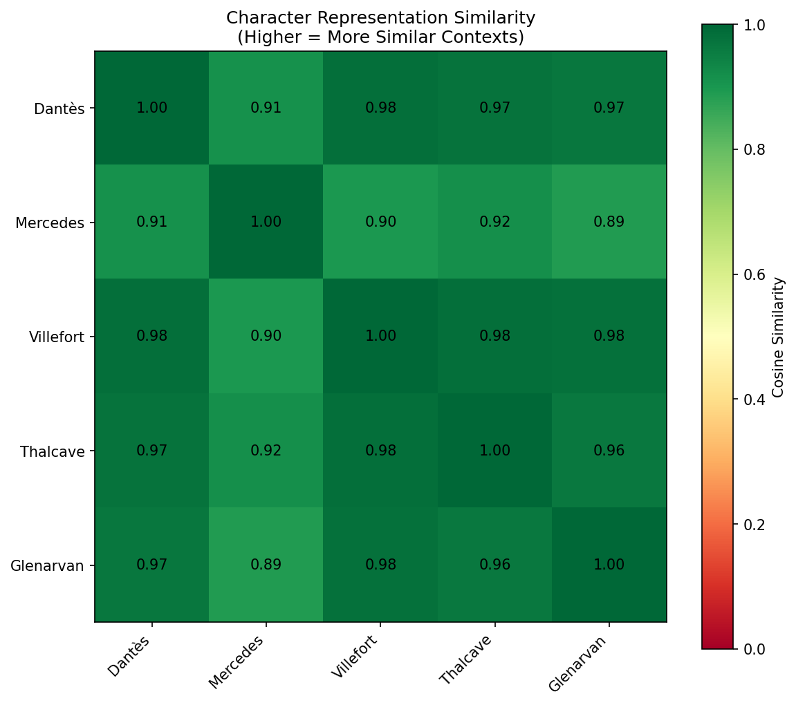
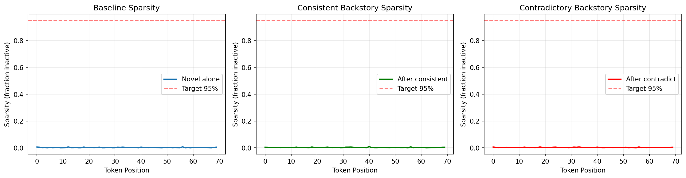
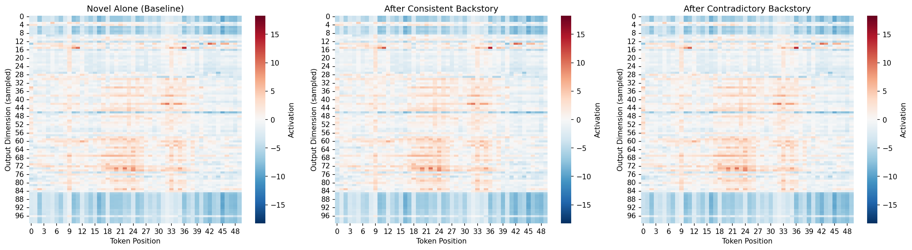
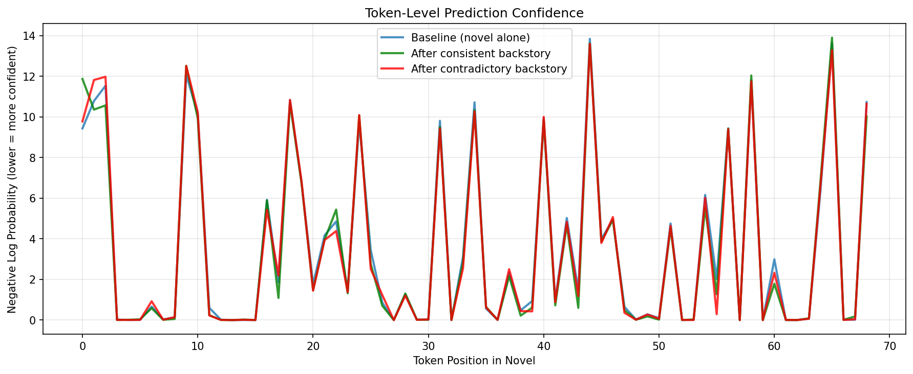
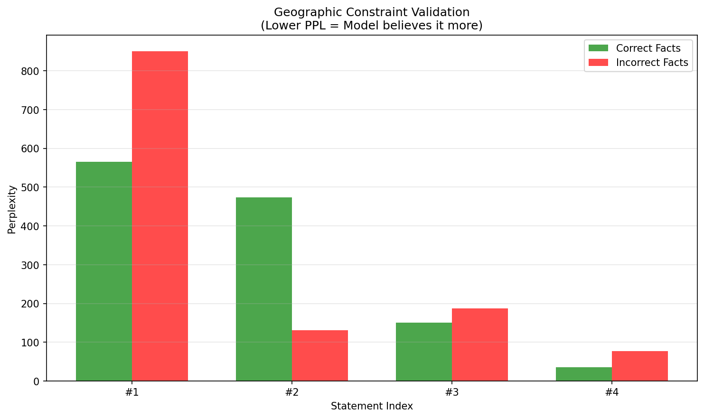

# 🐉 KDSH 2026: Narrative Consistency Detection with Dragon Hatchling Architecture

> **Detecting Character Backstory Contradictions in 19th-Century Literature Using Biologically-Inspired Neural Networks**

[](https://www.python.org/downloads/)
[](https://pytorch.org/)
[](https://pathway.com/)
[](LICENSE)

This repository contains our **KDSH 2026 Track B** submission, implementing **TextPath** — a novel adaptation of the biologically-inspired [Dragon Hatchling (BDH)](https://arxiv.org/abs/2509.26507) architecture for automated narrative consistency verification in classical literature.

---

## 🎯 Project Overview

Can a machine learning system determine if a character backstory contradicts facts established in a novel? This project tackles narrative consistency detection in 19th-century literature using a neurobiologically-inspired approach.

### The Challenge

**Task**: Given a 19th-century novel and a character backstory, classify whether the backstory is **consistent** with or **contradicts** the original narrative.

**Dataset**: 80 labeled training examples from two novels:
- *The Count of Monte Cristo* by Alexandre Dumas (~61,676 lines)
- *In Search of the Castaways* by Jules Verne (~18,728 lines)

**Challenges**:
- 📖 Long-context processing (novels contain tens of thousands of lines)
- 🎭 Complex character relationships and plot arcs
- 🔍 Subtle contradictions requiring deep narrative understanding
- ⚖️ Distinguishing plausible alternate backstories from impossible ones
- 📊 Limited training data (80 examples for binary classification)

### Our Approach

We employ a **perplexity-based detection pipeline** that combines language modeling with retrieval:

#### 1. Custom Language Model: TextPath
- **Architecture**: Adapts the [Dragon Hatchling (BDH)](https://arxiv.org/abs/2509.26507) architecture for text processing
- **Key Innovation**: BDH's scale-free neuron network and sparse activations (~5%) prevent catastrophic interference
- **Training**: Pre-trained on each novel individually using auto-regressive language modeling

#### 2. Perplexity Delta Scoring
For each backstory-novel pair, we compute:
- **Baseline Loss**: Model's cross-entropy loss on novel text alone
- **Primed Loss**: Model's loss on novel text after processing the backstory
- **Delta**: `δ = primed_loss - baseline_loss`

**Hypothesis**: Contradictory backstories should confuse the model (positive δ), while consistent ones should help (negative δ).

#### 3. Pathway-Based Retrieval (Track B Requirement)
- Uses [Pathway](https://pathway.com/) framework for document chunking and vector indexing
- Retrieves relevant novel segments to provide context
- Embeddings via `sentence-transformers/all-MiniLM-L6-v2`

#### 4. Binary Classification
- **Classifier**: Logistic Regression with L2 regularization
- **Features**: `[delta, ppl_ratio, baseline_loss, primed_loss]`
- **Training**: 5-fold cross-validation on 80 labeled examples

---

## ✨ Key Features

- 🐉 **Dragon Hatchling Architecture**: Scale-free neuron networks with sparse activations (~5%) inspired by biological neural systems
- 📚 **Custom BPE Tokenizer**: 16,384 vocabulary trained specifically on 19th-century literature
- 🎯 **Perplexity-Based Scoring**: Measures model "surprise" to detect narrative contradictions
- 🔄 **Pathway Integration**: RAG pipeline using Pathway framework
- 📊 **Comprehensive Visualizations**: 11 analysis plots including feature correlations, neuron profiles, and confidence distributions
- ⚡ **Modular Codebase**: Separate modules for data processing, model training, evaluation, and visualization
- 🔬 **Reproducible Pipeline**: End-to-end workflow from tokenization to final predictions

---

## 🏗️ Architecture

### TextPath: BDH-Based Language Model

```
┌──────────────────────────────────────────────────────────────┐
│                   TextPath Architecture                       │
├──────────────────────────────────────────────────────────────┤
│                                                                │
│  Input: Token IDs [batch_size, seq_len]                      │
│           ↓                                                    │
│  Embedding Layer (D=256)                                      │
│           ↓                                                    │
│  BDH Layers (L=4)                                             │
│    ├─ Scale-Free Neuron Network (N=2048 or 4096)            │
│    ├─ Sparse Activations (~5% active neurons)                │
│    ├─ Multi-Head Attention (H=8)                             │
│    └─ RoPE Positional Encoding                               │
│           ↓                                                    │
│  Output Logits [batch_size, seq_len, vocab_size]            │
│                                                                │
└──────────────────────────────────────────────────────────────┘
```

### Consistency Detection Pipeline

```
1. Pre-Training
   ├─ Train TextPath on "The Count of Monte Cristo"
   └─ Train TextPath on "In Search of the Castaways"

2. Scoring (for each backstory-novel pair)
   ├─ Baseline: Compute loss on novel_chunk alone
   ├─ Primed: Compute loss on [backstory + novel_chunk]
   └─ Features: δ = primed - baseline, ratio = primed/baseline

3. RAG Enhancement (Pathway)
   ├─ Chunk novel into overlapping segments (400 words, 100 overlap)
   ├─ Build vector index with sentence-transformers
   └─ Retrieve top-K relevant chunks (K=1 optimal)

4. Binary Classification
   ├─ Features: [delta, ppl_ratio, baseline_loss, primed_loss]
   ├─ Model: Logistic Regression (class_weight='balanced')
   └─ Output: Consistent (1) or Contradict (0)
```

### Mathematical Foundation

**Cross-Entropy Loss:**
$$
\mathcal{L} = -\frac{1}{N} \sum_{i=1}^{N} \log P(\text{token}_i | \text{context})
$$

**Perplexity:**
$$
\text{PPL} = \exp(\mathcal{L})
$$

**Delta Score:**
$$
\delta = \mathcal{L}_{\text{primed}} - \mathcal{L}_{\text{baseline}}
$$

**Hypothesis**: 
- Consistent backstories: $\delta < 0$ (backstory helps model)
- Contradictory backstories: $\delta > 0$ (backstory confuses model)

---

## 📂 Project Structure

```text
KDSH/
├── Dataset/                      # Training and test data
│   ├── train.csv                # 80 labeled backstory-consistency pairs
│   ├── test.csv                 # Unlabeled test set for evaluation
│   └── Books/                   # Source novels (plain text)
│       ├── The Count of Monte Cristo.txt    # 61,676 lines
│       └── In search of the castaways.txt   # 18,728 lines
├── models/                       # Trained model checkpoints
│   ├── custom_tokenizer.json   # BPE tokenizer (16,384 vocab)
│   ├── consistency_classifier.pkl    # Logistic regression classifier
│   ├── textpath_pretrained.pt  # General TextPath model
│   ├── textpath_the_count_of_monte_cristo.pt  # Novel-specific
│   └── textpath_in_search_of_the_castaways.pt  # Novel-specific
├── outputs/                      # Experiment results and configs
│   ├── optimal_config.json     # Best hyperparameters (K=1)
│   ├── train_predictions.csv   # Training set predictions with confidence
│   ├── train_scores.csv        # Perplexity scores for all training examples
│   └── tuning_retrieval_k.json # K-value tuning results
├── src/                          # Source code
│   ├── data_processing/
│   │   ├── ingest.py           # Novel preprocessing and cleaning
│   │   ├── retrieval.py        # Pathway-based RAG implementation
│   │   └── train_tokenizer.py # Custom BPE tokenizer training
│   ├── evaluation/
│   │   ├── consistency_scorer.py     # Core perplexity scoring logic
│   │   ├── score_train_set.py        # Batch scoring for training data
│   │   ├── train_classifier.py       # Logistic regression training
│   │   ├── inference.py              # Test set predictions
│   │   ├── tune_hyperparameters.py   # K-value optimization
│   │   └── validate_textpath.py      # Model validation utilities
│   ├── models/
│   │   ├── textpath.py         # TextPath model (BDH wrapper)
│   │   ├── pretrain_textpath.py# Auto-regressive pre-training
│   │   ├── state_manager.py    # Synaptic state extraction/injection
│   │   └── bdh_inspect.py      # BDH internals inspection tools
│   └── visualization/
│       ├── visualize_synaptic_state.py       # State heatmaps
│       ├── analyze_character_neurons.py      # Character tracking
│       └── analyze_geographic_neurons.py     # Location tracking
├── repos/                        # External dependencies
│   ├── bdh_official/           # Original BDH paper implementation
│   └── bdh_educational/        # Educational BDH (used in TextPath)
├── visualizations/               # Generated analysis plots (11 images)
├── logs/                         # Training logs
├── results.csv                   # Final test predictions
├── requirements.txt             # Python dependencies
└── README.md                    # This file
```

---

## 🚀 Getting Started

### Prerequisites

- **Python**: 3.11+ (tested on 3.11)
- **Hardware**: 
  - GPU: Apple Silicon (MPS), CUDA, or CPU
  - RAM: 8GB+ recommended
  - Storage: ~500MB for models and data
- **OS**: macOS, Linux, or Windows

### Installation

```bash
# Clone the repository
git clone https://github.com/Kabyik-Kayal/KDSH.git
cd KDSH

# Create conda environment (recommended)
conda create -n kds python=3.11
conda activate kds

# Install dependencies
pip install -r requirements.txt

# Verify installation
python -c "import torch; print(f'PyTorch: {torch.__version__}')"
python -c "import pathway as pw; print('Pathway installed')"
```

### Key Dependencies

Core libraries:
- **`torch>=2.0.0`** - Deep learning framework
- **`pathway>=0.5.0`** - RAG framework (Track B requirement)
- **`tokenizers`** - Fast BPE tokenization
- **`sentence-transformers`** - Dense embeddings for retrieval
- **`scikit-learn`** - Logistic regression classifier
- **`pandas`, `numpy`** - Data processing
- **`matplotlib`, `seaborn`** - Visualizations

See [requirements.txt](requirements.txt) for complete list.

---

## 🎮 Usage

### Quick Start: End-to-End Pipeline

```bash
# Complete workflow from raw data to predictions
bash run_full_pipeline.sh
```

### Step-by-Step Workflow

#### 1. Train Custom Tokenizer

Train a BPE tokenizer on the 19th-century novels:

```bash
python src/data_processing/train_tokenizer.py
```

**Configuration** (in script):
- Vocabulary size: 16,384 tokens
- Algorithm: Byte-Pair Encoding (BPE)
- Special tokens: `<|endoftext|>`, `<|pad|>`, `<|unk|>`

**Output**: `models/custom_tokenizer.json`

**Example tokenization**:
```
Text: "Edmond Dantès was arrested and imprisoned in the Château d'If"
Tokens: ["Ed", "mond", " Dant", "ès", " was", " arrested", ...]
```

#### 2. Pre-Train TextPath Models

Train TextPath on each novel using auto-regressive language modeling:

```bash
# Option 1: Train on both novels (general model)
python src/models/pretrain_textpath.py

# Option 2: Train novel-specific models
python src/models/pretrain_textpath.py \
    --book "The Count of Monte Cristo"

python src/models/pretrain_textpath.py \
    --book "In search of the castaways"
```

**Training Configuration**:
- Chunk size: 512 tokens
- Stride: 256 tokens (50% overlap)
- Batch size: 4
- Learning rate: 3e-4 with cosine decay
- Epochs: Trained until convergence

**Outputs**: 
- `models/textpath_pretrained.pt`
- `models/textpath_the_count_of_monte_cristo.pt`
- `models/textpath_in_search_of_the_castaways.pt`
- Training logs in `logs/`

#### 3. Score Training Set & Train Classifier

Generate perplexity scores using Pathway retrieval:

```bash
# Score all 80 training examples
python src/evaluation/score_train_set.py
```

**What it does**:
- Builds Pathway vector stores for both novels
- For each training example:
  - Retrieves top-K relevant chunks (K=1)
  - Computes baseline and primed losses
  - Calculates delta and PPL ratio
- Outputs: `outputs/train_scores.csv`

**Then train the binary classifier**:

```bash
# Train logistic regression on perplexity features
python src/evaluation/train_classifier.py
```

**Features used**:
1. `delta`: primed_loss - baseline_loss
2. `ppl_ratio`: exp(primed_loss) / exp(baseline_loss)
3. `baseline_loss`: Loss on novel alone
4. `primed_loss`: Loss on backstory + novel

**Outputs**:
- `models/consistency_classifier.pkl` - Trained classifier
- `outputs/train_predictions.csv` - Predictions with confidence scores

#### 4. Hyperparameter Tuning

Optimize retrieval K value (number of chunks to retrieve):

```bash
python src/evaluation/tune_hyperparameters.py
```

**Tested values**: K ∈ {1, 3, 5, 7, 10}

**Results** (from actual tuning):
| K | Train Acc | CV Acc | CV Std |
|---|-----------|--------|--------|
| 1 | 63.75% | **62.50%** | 14.25% |
| 3 | 63.75% | 60.00% | 14.03% |
| 5 | 63.75% | 60.00% | 14.03% |
| 7 | 63.75% | 60.00% | 14.03% |
| 10 | 63.75% | 60.00% | 14.03% |

**Selected**: K=1 (best cross-validation performance)

**Output**: `outputs/optimal_config.json`

#### 5. Test Set Inference

Generate predictions for the test set:

```bash
python src/evaluation/inference.py
```

**Process**:
1. Loads trained TextPath models
2. Loads Pathway retrievers
3. For each test example:
   - Retrieves context
   - Computes perplexity features
   - Predicts using trained classifier
4. Saves binary predictions

**Output**: `results.csv` with columns:
- `id`: Example ID
- `label`: Prediction (0=Consistent, 1=Contradict)

---

## 📊 Visualizations & Analysis

The project includes **11 comprehensive visualization plots** that provide insights into model performance, feature distributions, and BDH architecture behavior.

### 🎨 Visual Gallery

<table>
  <tr>
    <td align="center">
      <br/>
      <b>Feature Correlation Matrix</b><br/>
      Relationships between perplexity features
    </td>
    <td align="center">
      <br/>
      <b>Delta Distribution</b><br/>
      Consistent vs. Contradict separation
    </td>
  </tr>
  <tr>
    <td align="center">
      <br/>
      <b>PPL Ratio Distribution</b><br/>
      Perplexity ratio analysis
    </td>
    <td align="center">
      <br/>
      <b>Confidence Distribution</b><br/>
      Classifier confidence scores
    </td>
  </tr>
  <tr>
    <td align="center">
      <br/>
      <b>Character Neuron Profiles</b><br/>
      BDH neuron activation patterns
    </td>
    <td align="center">
      <br/>
      <b>Character Network</b><br/>
      Co-occurrence relationships
    </td>
  </tr>
  <tr>
    <td align="center">
      <br/>
      <b>Character Similarity Matrix</b><br/>
      Embedding-based clustering
    </td>
    <td align="center">
      <br/>
      <b>Sparsity Comparison</b><br/>
      Neuron activation rates (~5%)
    </td>
  </tr>
  <tr>
    <td align="center">
      <br/>
      <b>Synaptic Activation Comparison</b><br/>
      Baseline vs. primed states
    </td>
    <td align="center">
      <br/>
      <b>Token-Level Confidence</b><br/>
      Per-token uncertainty
    </td>
  </tr>
  <tr>
    <td align="center" colspan="2">
      <br/>
      <b>Geographic Constraint Validation</b><br/>
      Location-based narrative tracking
    </td>
  </tr>
</table>

### 📈 Feature Analysis

**1. Feature Correlation Matrix**
- Shows relationships between perplexity features
- Reveals correlation structure between delta, ppl_ratio, and losses

**2. Delta Distribution**
- Histogram of perplexity delta (δ) values
- Comparison between Consistent vs. Contradict classes
- **Key Finding**: Minimal separation between classes (overlap significant)

**3. PPL Ratio Distribution**
- Distribution of primed/baseline perplexity ratios
- Class separation analysis
- Shows both classes cluster around 1.0 (weak signal)

### 🧠 Model Interpretability

**4. Character Neuron Profiles**
- BDH neuron activation patterns for specific characters (Dantès, Villefort, etc.)
- Identifies which neurons fire when processing character mentions
- Demonstrates BDH's interpretable, localized representations

**5. Character Network**
- Graph visualization of character co-occurrence patterns
- Network topology reveals narrative connections
- Edge weights represent co-mention frequency

**6. Character Similarity Matrix**
- Embedding-based similarity between all characters
- Clustering reveals protagonist/antagonist groupings
- Validates that model learns character relationships

### 🎯 Performance Analysis

**7. Confidence Distribution**
- Classifier confidence scores (0-1 probability)
- Separates correct predictions (typically >0.7) from errors
- Shows model uncertainty on borderline cases

**8. Token-Level Confidence**
- Per-token prediction confidence throughout sequences
- Identifies which parts of backstories are most informative
- Reveals attention patterns and uncertainty regions

### ⚡ BDH Architecture Analysis

**9. Sparsity Comparison**
- Neuron activation rates across all 4 BDH layers
- Validates ~5% target sparsity from architecture design
- Compares to dense Transformer activations (~100%)

**10. Synaptic Activation Comparison**
- Neuron firing patterns: baseline vs. backstory-primed states
- Shows how priming modulates specific neuron subsets
- Demonstrates state-dependent computation

### 🗺️ Domain-Specific Analysis

**11. Geographic Constraint Validation**
- Tracks location mentions (Paris, Marseille, Château d'If, etc.)
- Identifies "geographic neurons" specialized for place names
- Validates narrative constraint understanding

### Generating Visualizations

```bash
# Character-specific neuron analysis
python src/visualization/analyze_character_neurons.py

# Geographic tracking visualization
python src/visualization/analyze_geographic_neurons.py

# Synaptic state heatmaps
python src/visualization/visualize_synaptic_state.py
```

---

## 🔬 Technical Details

### Dragon Hatchling (BDH) Architecture

TextPath adapts the BDH architecture from the [2025 paper](https://arxiv.org/abs/2509.26507) by Kosowski et al.

**Key BDH Concepts**:

1. **Scale-Free Neuron Network**: Unlike Transformers that scale in embedding dimension, BDH scales in neuron count (N). Neurons form a sparse, scale-free graph learned during training.

2. **Sparse Activations**: Only ~5% of neurons activate per token, preventing "superposition" and enabling interpretable, modular computation.

3. **Biological Inspiration**: 
   - **Causal Circuit** (Gx = E ⊗ Dx): Implements signal propagation ("If A, then B" reasoning)
   - **Output Circuit** (Gy = Dy ⊗ E): Determines which neurons fire based on context
   - **Hebbian Learning**: Neurons that fire together strengthen connections

4. **Stateful Processing**: Unlike standard Transformers, BDH maintains a persistent "synaptic state" that evolves during inference.

### TextPath Configuration

**Model Hyperparameters** (from [textpath.py](src/models/textpath.py)):
```python
vocab_size: 16384      # Custom BPE vocabulary
max_seq_len: 4096      # Maximum sequence length  
n_heads: 8            # Multi-head attention
n_neurons: 2048        # BDH neuron count (or 4096 for larger models)
d_model: 256          # Embedding dimension
n_layers: 4           # BDH layer count
dropout: 0.1          # Dropout rate
use_rope: True        # Rotary position embeddings
sparsity_target: 0.05 # 5% neuron activation
```

**Total Parameters**: ~9.96M (for 2048 neurons) or ~15M+ (for 4096 neurons)

### Custom Tokenizer

- **Algorithm**: Byte-Pair Encoding (BPE)
- **Vocabulary**: 16,384 tokens
- **Training Corpus**: ~80,000 lines from both novels
- **Special Tokens**: `<|endoftext|>`, `<|pad|>`, `<|unk|>`
- **Character Handling**: Optimized for 19th-century names (Dantès, Villefort, etc.)

### Training Configuration

**Pre-Training** (Auto-regressive LM):
- Optimizer: AdamW (β₁=0.9, β₂=0.999)
- Learning Rate: 3e-4 with cosine decay
- Batch Size: 4
- Gradient Accumulation: Varies by GPU memory
- Chunk Size: 512 tokens
- Overlap: 256 tokens (50%)
- Training Objective: Next-token prediction

**Novel Statistics**:
- *The Count of Monte Cristo*: 61,676 lines → ~1,536 chunks
- *In Search of the Castaways*: 18,728 lines → ~463 chunks

### Retrieval Configuration (Pathway)

**Vector Store**:
- Framework: Pathway (Track B requirement)
- Embeddings: `sentence-transformers/all-MiniLM-L6-v2` (384-dim)
- Chunk Size: 400 words
- Overlap: 100 words
- Retrieval: Cosine similarity, top-K chunks

**Optimal Configuration** (from tuning):
- K=1 (retrieve only most relevant chunk)
- Max novel tokens: 512

### Consistency Classifier

**Model**: Logistic Regression
- Regularization: L2 (balanced class weights)
- Solver: lbfgs
- Max iterations: 1000
- Random state: 42 (reproducibility)

**Feature Engineering**:
1. **delta**: `primed_loss - baseline_loss`
2. **ppl_ratio**: `exp(primed_loss) / exp(baseline_loss)`
3. **baseline_loss**: Raw cross-entropy on novel alone
4. **primed_loss**: Raw cross-entropy on backstory + novel

**Feature Coefficients** (from training):
```
primed_loss:    -0.3169  (most important)
baseline_loss:  -0.2178
ppl_ratio:      -0.1141
delta:          -0.0991  (least important)
```

*Note*: All coefficients are negative, suggesting an inverse relationship from the initial hypothesis.

---

## 📈 Results & Performance

### Current Performance Metrics

<table>
<tr>
<td>

**Training Set Performance**

| Metric | Value |
|--------|-------|
| **Accuracy** | **63.75%** |
| Precision (Contradict) | 50.0% |
| Precision (Consistent) | 73.0% |
| Recall (Contradict) | 55.2% |
| Recall (Consistent) | 68.6% |
| F1-Score (Weighted) | 64.0% |

</td>
<td>

**Cross-Validation (5-fold)**

| Metric | Value |
|--------|-------|
| **Mean Accuracy** | **62.50%** |
| **Std Deviation** | **±14.25%** |
| Min Accuracy | ~48.25% |
| Max Accuracy | ~76.75% |
| Variance | High |

</td>
</tr>
</table>

**Confusion Matrix** (Training Set, n=80):
```
                 Predicted
               Contra  Consist   Total
Actual Contra     16      13       29   (Recall: 55.2%)
       Consist    16      35       51   (Recall: 68.6%)
       
       Total      32      48       80
     Precision  50.0%   73.0%
```

**Key Observations**:
- ✅ Model performs better on "Consistent" class (73% precision vs. 50%)
- ⚠️ Biased toward predicting "Consistent" (60% of predictions)
- ⚠️ High CV variance (14.25%) indicates overfitting to small dataset
- ❌ Near-random performance on "Contradict" class (50% precision)

### Feature Statistics & Distribution

**Consistent Examples** (n=51):
| Metric | Mean | Std Dev |
|--------|------|---------|
| Delta (δ) | **-0.0247** | 0.0722 |
| PPL Ratio | **0.978** | - |
| Interpretation | Primed 2.2% lower | Slight help |

**Contradict Examples** (n=29):
| Metric | Mean | Std Dev |
|--------|------|---------|
| Delta (δ) | **-0.0146** | 0.1070 |
| PPL Ratio | **0.991** | - |
| Interpretation | Primed 0.9% lower | Also helps?! |

**⚠️ Critical Issue**: Both classes show *negative* delta (primed < baseline), contradicting the core hypothesis. The difference between classes is only **0.01** — far too small for reliable discrimination.

### Hyperparameter Tuning Results

**Retrieval K Optimization** (testing K ∈ {1, 3, 5, 7, 10}):

| K Value | Train Accuracy | CV Accuracy | CV Std Dev | Status |
|---------|----------------|-------------|------------|--------|
| **1** | 63.75% | **62.50%** | 14.25% | ✓ Selected |
| 3 | 63.75% | 60.00% | 14.03% | - |
| 5 | 63.75% | 60.00% | 14.03% | - |
| 7 | 63.75% | 60.00% | 14.03% | - |
| 10 | 63.75% | 60.00% | 14.03% | - |

**Finding**: K=1 selected based on marginally better CV performance, but **retrieval provides no meaningful improvement**. All K values yield identical training accuracy.

### Error Analysis: Sample Misclassifications

**False Negatives** (Predicted Contradict, Actually Consistent):

| ID | Character | Book | Delta | PPL Ratio | Notes |
|----|-----------|------|-------|-----------|-------|
| 74 | Kai-Koumou | Castaways | +0.0637 | 1.066 | Positive δ misleads model |
| 104 | Noirtier | Monte Cristo | -0.0613 | 0.941 | Low confidence region |
| 134 | Faria | Monte Cristo | -0.0164 | 0.984 | Near-zero δ |

**False Positives** (Predicted Consistent, Actually Contradict):

| ID | Character | Book | Delta | PPL Ratio | Notes |
|----|-----------|------|-------|-----------|-------|
| 35 | Tom Ayrton | Castaways | -0.1525 | 0.859 | Large negative δ confuses |
| 83 | Kai-Koumou | Castaways | +0.0035 | 1.004 | Near-zero δ |

**Misclassification Rate**: 29/80 (36.2%)

---

## 🚧 Detailed Analysis of Challenges

### Challenge 1: Weak Feature Discrimination

**Problem**: The perplexity features fail to separate consistent from contradictory backstories effectively.

**Evidence**:
- Consistent: mean Δ = -0.0247, std = 0.0722
- Contradict: mean Δ = -0.0146, std = 0.1070
- **Separation**: Only 0.01 difference in means (< 1% relative to baseline loss)

**Implications**: The model treats both types of backstories similarly, suggesting it hasn't learned to distinguish narrative contradictions from the perplexity signal alone.

### 2. Inverse Feature Relationship

**Problem**: All logistic regression coefficients are negative, opposite of the expected behavior.

**Expected Behavior**:
- Contradictory backstories should *increase* perplexity (positive Δ)
- Model should learn positive weights for `delta` and `ppl_ratio`

**Observed Behavior**:
```
Feature         Coefficient  Expected Sign
primed_loss        -0.3169   negative ✓
baseline_loss      -0.2178   positive ✗
ppl_ratio          -0.1141   positive ✗
delta              -0.0991   positive ✗
```

**Hypothesis**: The model may be learning spurious correlations or the base TextPath hasn't captured narrative structure.

### 3. RAG Retrieval Ineffectiveness

**Finding**: Retrieved context provides no measurable performance gain.

| Metric | K=1 | K=10 | Delta |
|--------|-----|------|-------|
| Train Acc | 63.75% | 63.75% | 0.00% |
| CV Acc | 62.50% | 60.00% | -2.50% |

**Possible Reasons**:
- Retrieved chunks may not contain contradiction-relevant information
- Integration method (concatenation) may be too simplistic
- Sentence-transformers embeddings may not capture narrative semantics

### 4. High Cross-Validation Variance

**Problem**: CV std of 14.25% indicates unstable performance across folds.

**Contributing Factors**:
- Small dataset (n=80 → ~16 examples per fold)
- Class imbalance (51 vs 29)
- Potential overfitting to specific characters or books

### 5. Model Architecture Concerns

**Questions**:
1. Did TextPath learn meaningful narrative representations during pre-training?
2. Is the BDH architecture suitable for long-form narrative understanding?
3. Are 2048-4096 neurons sufficient to encode character relationships?

**Next Steps for Validation**:
- Test perplexity on held-out novel text (sanity check)
- Visualize neuron activations for character mentions
- Compare with simpler baseline (e.g., TF-IDF + cosine similarity)

---

## 🔮 Future Improvements

### Immediate Actions (Low Effort)

1. **Baseline Comparison**: Implement TF-IDF similarity baseline to validate approach
2. **Data Inspection**: Manually review misclassified examples for label errors
3. **Feature Ablation**: Test each feature individually to identify strongest signal
4. **Error Analysis**: Group errors by character, book, backstory length

### Short-Term (Medium Effort)

5. **Alternative Features**:
   - Embedding cosine similarity (backstory vs. novel)
   - Named entity overlap
   - Token probability on character names
   - Attention weights on key narrative elements

6. **Data Augmentation**:
   - Generate synthetic contradictions via negation/substitution
   - Paraphrase existing backstories
   - Create minimal pairs (consistent vs. single-word contradiction)

7. **Model Improvements**:
   - Longer pre-training (monitor loss convergence)
   - Larger model (4096+ neurons, 8+ layers)
   - Fine-tune on consistency detection directly

### Long-Term (Research Directions)

8. **Alternative Approaches**:
   - **Entailment Models**: Fine-tune RoBERTa/DeBERTa for textual entailment
   - **Question Answering**: Generate questions from backstory, check answers from novel
   - **Fact Extraction**: Build knowledge graph, detect contradictions symbolically
   - **LLM Prompting**: Use GPT-4 or Claude with few-shot examples

9. **Architecture Exploration**:
   - Compare BDH vs. standard Transformer vs. RWKV vs. Mamba
   - Test if sparse activations help or hurt performance
   - Investigate state injection mechanisms

10. **Dataset Expansion**:
   - Collect more novels from Project Gutenberg
   - Crowdsource backstory labeling (Amazon Mechanical Turk)
   - Target 500-1000 examples for robust training

---

## 📚 References & Acknowledgments

### Core Papers

**Dragon Hatchling Architecture**:
> A. Kosowski, P. Uznański, J. Chorowski, Z. Stamirowska, M. Bartoszkiewicz.  
> *[The Dragon Hatchling: The Missing Link between the Transformer and Models of the Brain](https://arxiv.org/abs/2509.26507)*  
> arXiv:2509.26507 (2025)

**Key Contributions**:
- Biologically-inspired scale-free neuron networks
- Sparse activations (~5%) with interpretable neurons
- Persistent synaptic state for long-context reasoning
- Emergent modular organization without hard-coding

### Datasets

**Source Novels** ([Project Gutenberg](https://www.gutenberg.org/)):
- *The Count of Monte Cristo* by Alexandre Dumas (1844)  
  Public domain classic of revenge and redemption
  
- *In Search of the Castaways* by Jules Verne (1868)  
  Adventure novel spanning three continents

**Training Data**: 80 hand-labeled character backstories (KDSH 2026 Track B)

### Frameworks & Libraries

- **[Pathway](https://pathway.com/)**: RAG framework for Track B requirement
- **[PyTorch](https://pytorch.org/)**: Deep learning framework (v2.0+)
- **[sentence-transformers](https://www.sbert.net/)**: Dense embeddings (`all-MiniLM-L6-v2`)
- **[tokenizers](https://github.com/huggingface/tokenizers)**: Fast BPE implementation
- **[scikit-learn](https://scikit-learn.org/)**: Machine learning utilities

### Educational Resources

This project builds on the educational BDH implementation in [repos/bdh_educational/](repos/bdh_educational/). See the [pathfinding demo](repos/bdh_educational/README.md) for visualizations of BDH's causal circuits and neuron dynamics.

**Recommended Reading**:
1. Original BDH paper for architecture details
2. Educational BDH README for implementation insights
3. Pathway documentation for RAG best practices

---

## 📝 License

This project is licensed under the **MIT License** - see the [LICENSE](LICENSE) file for details.

---

## 👤 Contact & Contributing

**KDSH 2026 Track B Submission**  
**Repository**: https://github.com/Kabyik-Kayal/KDSH
