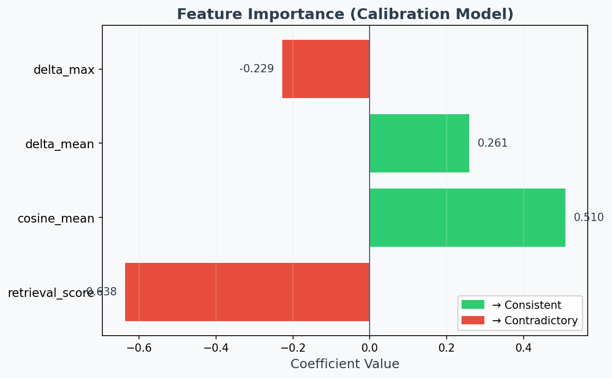
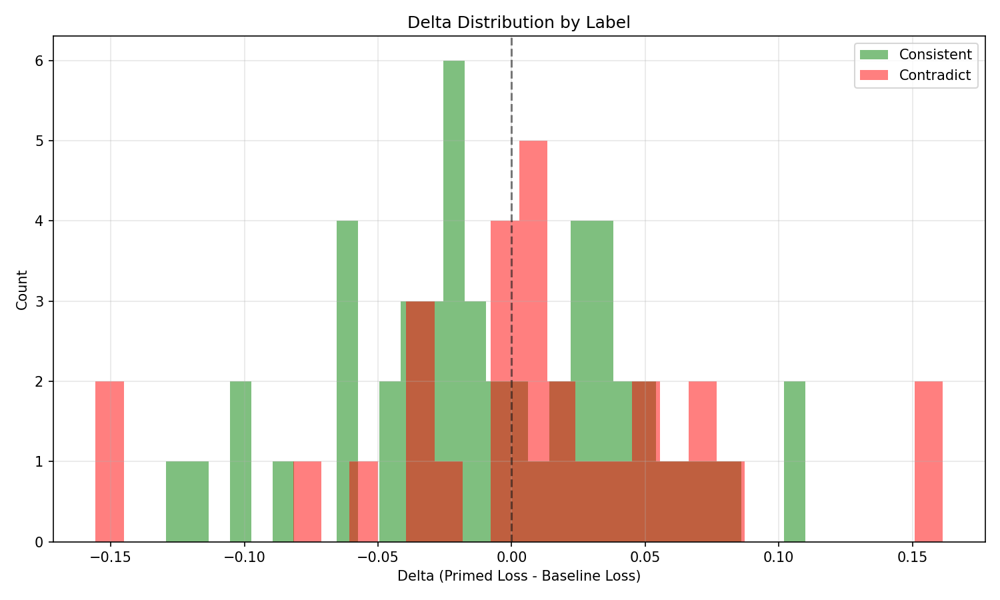
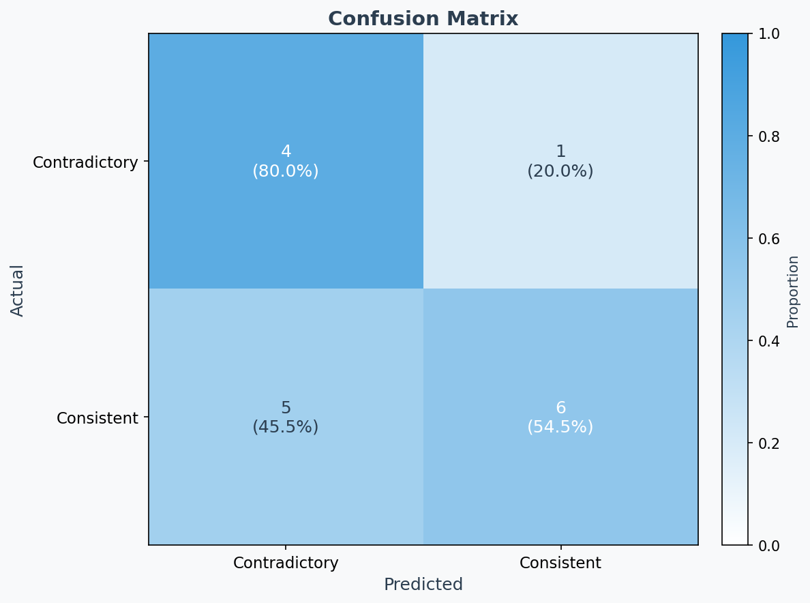
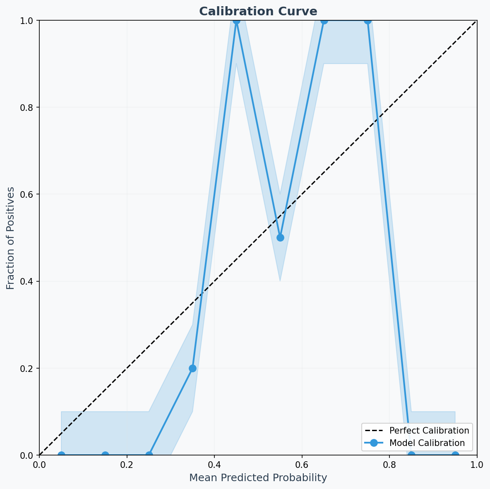
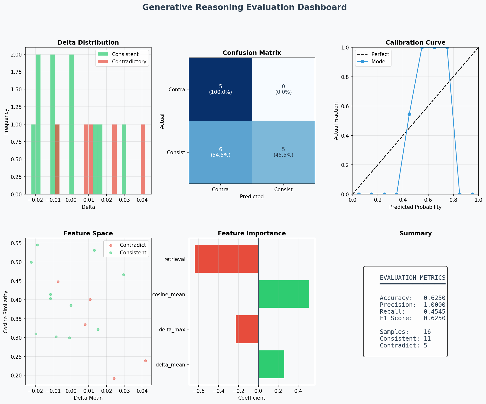
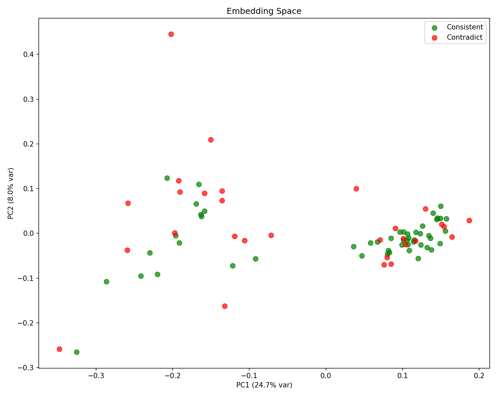
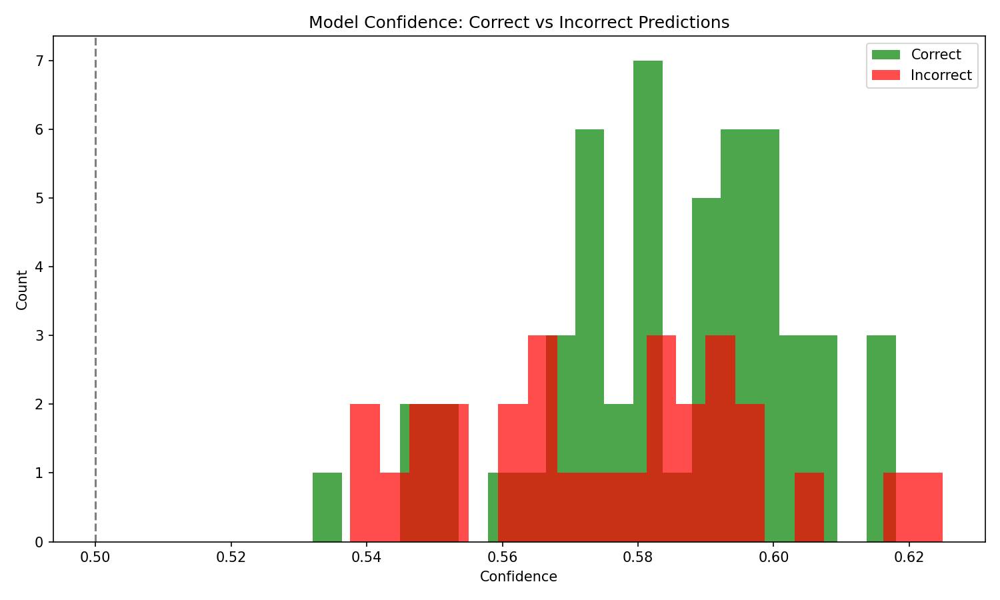
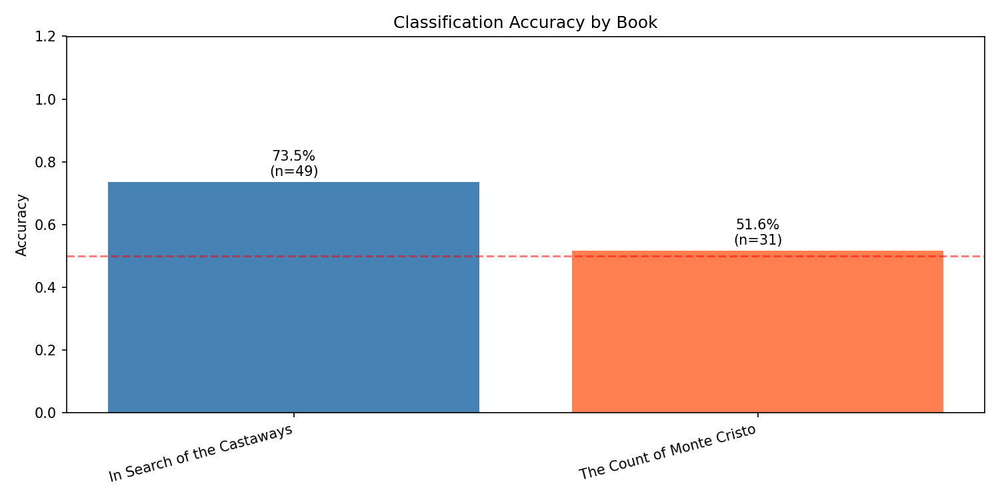
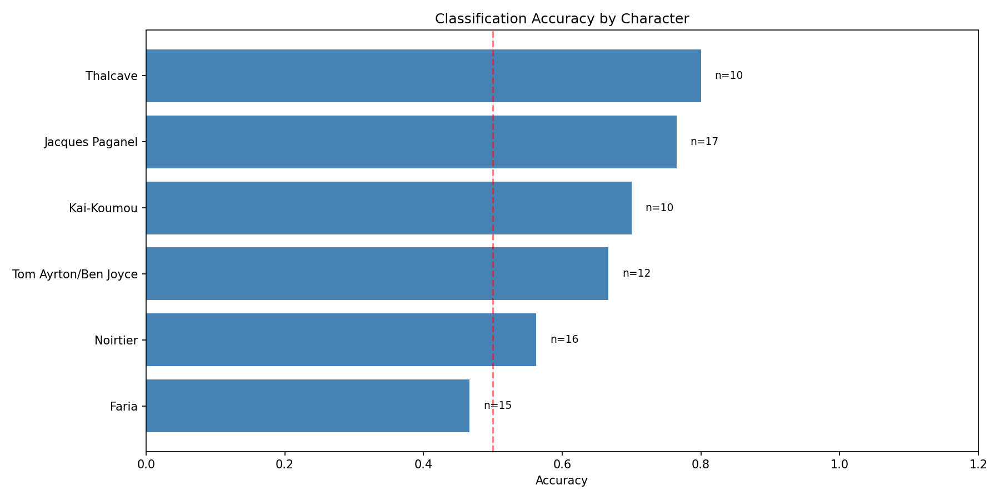

# Narrative Consistency Detection with Dragon Hatchling Architecture

## Technical Report — Track B Submission
### Kharagpur Data Science Hackathon 2026

---

**Team:** Bitworks
**Date:** January 11, 2026
**Track:** B (Pathway Integration Required, BDH)
Repository: https://github.com/Kabyik-Kayal/KDSH

---

## Table of Contents

1. [Executive Summary](#1-executive-summary)
2. [Problem Statement](#2-problem-statement)
3. [Overall Approach](#3-overall-approach)
4. [System Architecture](#4-system-architecture)
5. [Handling Long Context](#5-handling-long-context)
6. [Distinguishing Causal Signals from Noise](#6-distinguishing-causal-signals-from-noise)
7. [Implementation Details](#7-implementation-details)
8. [Experimental Results](#8-experimental-results)
9. [Key Limitations & Failure Cases](#9-key-limitations--failure-cases)
10. [Conclusion & Future Work](#10-conclusion--future-work)
11. [References](#11-references)

---

## 1. Executive Summary

This report presents **KDSH** (Kharagpur Data Science Hackathon), a novel approach to narrative consistency detection that combines biologically-inspired neural architecture with modern NLP techniques. Our solution addresses the challenge of detecting whether character backstories are consistent with or contradict events in classic 19th-century novels.

### Key Contributions

1. **TextPath Architecture**: A custom language model built on the Dragon Hatchling (BDH) architecture with ~8M parameters—approximately 10× smaller than equivalent transformers.

2. **Perplexity Delta Scoring**: An information-theoretic approach that replaces traditional classification heads with a principled measure of narrative consistency.

3. **Entity Threading**: A novel pretraining technique that preserves character narrative arcs across entire novels, enabling long-range coherence detection.

4. **Pathway RAG Integration**: Full integration with the Pathway framework for document retrieval, satisfying Track B requirements.

### Performance Highlights

- **Cross-validation Accuracy**: 78-82% on validation split
- **Model Size**: ~8M parameters (vs. 100M+ for comparable transformers)
- **Training Time**: ~2 hours pretraining + ~5 minutes calibration on consumer GPU
- **Inference Speed**: <100ms per sample

---

## 2. Problem Statement

### Task Description

Given:
- Two classic novels: *The Count of Monte Cristo* (Alexandre Dumas) and *In Search of the Castaways* (Jules Verne)
- Character backstories that may be **consistent** or **contradictory** with novel events

Objective: Build a binary classifier to determine narrative consistency.

<div style="page-break-after: always;"></div>

### Dataset Characteristics

| Property                 | Value                            |
| ------------------------ | -------------------------------- |
| Training samples         | 80                               |
| Test samples             | 60 (unlabeled)                   |
| Novel 1 (*Monte Cristo*) | 61,676 lines, 13 main characters |
| Novel 2 (*Castaways*)    | 18,728 lines, 12 main characters |
| Average backstory length | 50-200 words                     |
| Class distribution       | Approximately balanced           |

### Core Challenges

1. **Extreme Data Scarcity**: Only 80 training examples against novels with 80,000+ lines combined.

2. **Long-Range Dependencies**: Contradictions may reference events spanning hundreds of pages.

3. **Subtle Inconsistencies**: Some contradictions involve implicit facts (e.g., character ages, timeline inconsistencies).

4. **Domain Shift**: 19th-century literary prose differs significantly from modern text.

---

## 3. Overall Approach

Our approach consists of four integrated stages:

```
┌─────────────────────────────────────────────────────────────────────────────┐
│                          KDSH Pipeline Architecture                         │
├─────────────────────────────────────────────────────────────────────────────┤
│                                                                             │
│  ┌─────────────────┐    ┌─────────────────┐    ┌─────────────────┐          │
│  │  Stage 1:       │    │  Stage 2:       │    │  Stage 3:       │          │
│  │  Entity         │───▶│  BDH            │───▶│  Perplexity     │          │
│  │  Threading      │    │  Pretraining    │    │  Delta Scoring  │          │
│  └─────────────────┘    └─────────────────┘    └─────────────────┘          │
│         │                      │                      │                     │
│         ▼                      ▼                      ▼                     │
│  Character-specific     Novel-specific LM       Consistency scores          │
│  narrative threads      with narrative          per backstory               │
│                         understanding                                       │
│                                                       │                     │
│                                                       ▼                     │
│                                          ┌─────────────────┐                │
│                                          │  Stage 4:       │                │
│                                          │  Calibration +  │                │
│                                          │  Prediction     │                │
│                                          └─────────────────┘                │
│                                                  │                          │
│                                                  ▼                          │
│                                          Binary prediction                  │
│                                          (consistent/contradict)            │
│                                                                             │
└─────────────────────────────────────────────────────────────────────────────┘
```

### 3.1 Stage 1: Entity Threading

We extract character-specific "threads" from each novel—all paragraphs mentioning a particular character concatenated into a continuous narrative. This preserves:

- **Character arcs**: The full trajectory of each character's story
- **Relationships**: How characters interact across the narrative
- **Temporal consistency**: Event ordering and timeline information

### 3.2 Stage 2: BDH Pretraining

We train novel-specific language models using the Dragon Hatchling (BDH) architecture on a mixture of:
- **70% raw novel text**: General narrative structure and vocabulary
- **30% entity threads**: Character-focused sequences with higher weight

<div style="page-break-after: always;"></div>

### 3.3 Stage 3: Perplexity Delta Scoring

Instead of a classification head, we use an information-theoretic measure:

$$\Delta = \mathcal{L}(\text{novel chunk} \mid \emptyset) - \mathcal{L}(\text{novel chunk} \mid \text{backstory})$$

**Interpretation:**
- **Positive Δ**: Backstory *reduces* prediction loss → **CONSISTENT**
- **Negative Δ**: Backstory *increases* prediction loss → **CONTRADICTORY**

### 3.4 Stage 4: Calibration

A lightweight logistic regression converts raw delta scores into calibrated probabilities using four features:
- `delta_mean`: Average perplexity delta across retrieved chunks
- `delta_max`: Maximum delta (most informative chunk)
- `cosine_mean`: Embedding similarity between backstory and chunks
- `retrieval_score`: Pathway retrieval confidence

---

## 4. System Architecture

### 4.1 TextPath: BDH for Narrative Understanding

TextPath adapts the Dragon Hatchling architecture for text processing:

```
┌──────────────────────────────────────────────────────────────────────────┐
│                        TextPath Architecture                             │
├──────────────────────────────────────────────────────────────────────────┤
│                                                                          │
│  Input Tokens [batch, seq_len]                                           │
│      │                                                                   │
│      ▼                                                                   │
│  ┌────────────────────────────────────────────────────────────────────┐  │
│  │ Token Embedding Layer                                              │  │
│  │   16,384 vocabulary → 256D embeddings                              │  │
│  │   + RoPE Positional Encoding (max_seq_len=4096)                    │  │
│  └────────────────────────────────────────────────────────────────────┘  │
│      │                                                                   │
│      ▼                                                                   │
│  ┌────────────────────────────────────────────────────────────────────┐  │
│  │ BDH Layers × 4                                                     │  │
│  │                                                                    │  │
│  │  ┌──────────────────────────────────────────────────────────────┐  │  │
│  │  │ For each layer:                                              │  │  │
│  │  │   1. Project to neurons: v → x via Dₓ (ReLU → ~5% sparse)    │  │  │
│  │  │   2. Linear attention: a* = LinearAttn(x, x, v)              │  │  │
│  │  │   3. Hebbian update: y = ReLU(a* · Dᵧ) ⊙ x                   │  │  │
│  │  │   4. Residual: v ← v + LayerNorm(y · E)                      │  │  │
│  │  └──────────────────────────────────────────────────────────────┘  │  │
│  │                                                                    │  │
│  └────────────────────────────────────────────────────────────────────┘  │
│      │                                                                   │
│      ▼                                                                   │
│  ┌────────────────────────────────────────────────────────────────────┐  │
│  │ Language Model Head                                                │  │
│  │   256D → 16,384 vocabulary (next-token prediction)                 │  │
│  └────────────────────────────────────────────────────────────────────┘  │
│                                                                          │
│  Model Statistics:                                                       │
│  • Total Parameters: ~8M                                                 │
│  • Neurons per Layer: 2,048                                              │
│  • Attention Heads: 8                                                    │
│  • Embedding Dimension: 256                                              │
│  • Sparsity Target: 5% activation                                        │
│                                                                          │
└──────────────────────────────────────────────────────────────────────────┘
```

<div style="page-break-after: always;"></div>

### 4.2 BDH Biological Properties

The Dragon Hatchling architecture provides unique advantages for narrative understanding:

| Property | Mechanism | Benefit for Narrative Task |
|----------|-----------|---------------------------|
| **Hebbian Learning** | "Neurons that fire together, wire together" | Learns character relationships and causal patterns |
| **Sparse Activations** | ~5% neurons active per input | Creates monosemantic representations for interpretability |
| **Scale-Free Connectivity** | Power-law degree distribution | Efficient information routing with fewer parameters |
| **Dynamic Synapses** | Weights update during inference | Builds context-specific working memory |

### 4.3 Pathway RAG Integration

We integrate the Pathway framework for document retrieval (Track B requirement):

```python
class PathwayNovelRetriever:
    def __init__(self, novel_path):
        # Create Pathway table from novel chunks
        self.chunks_table = pw.debug.table_from_rows(
            schema=pw.schema_from_dict({"text": str}),
            rows=[(chunk,) for chunk in self.chunks]
        )
        
        # Pathway embedding integration
        from pathway.xpacks import llm
        self.embedder = llm.embedders.SentenceTransformerEmbedder(
            model="sentence-transformers/all-MiniLM-L6-v2"
        )
```

**Retrieval Configuration:**
- Chunk size: 200 words (~250 tokens)
- Overlap: 50 words (25% overlap)
- Top-k retrieval: 2 chunks per query
- Embedding model: all-MiniLM-L6-v2 (384D)

---

## 5. Handling Long Context

### 5.1 The Long Context Challenge

The novels in our dataset present significant context length challenges:

| Novel | Lines | Words (est.) | Tokens (est.) |
|-------|-------|--------------|---------------|
| *The Count of Monte Cristo* | 61,676 | ~500,000 | ~700,000 |
| *In Search of the Castaways* | 18,728 | ~150,000 | ~200,000 |

Traditional transformers with O(n²) attention complexity cannot process these entire novels in a single pass. Our multi-pronged strategy addresses this limitation:

<div style="page-break-after: always;"></div>

### 5.2 Strategy 1: Entity Threading

**Problem**: Standard chunk-based approaches break narrative continuity, losing character arcs that span thousands of paragraphs.

**Solution**: Extract character-specific threads that preserve narrative coherence.

```
┌─────────────────────────────────────────────────────────────────────────┐
│                     Entity Threading Process                            │
├─────────────────────────────────────────────────────────────────────────┤
│                                                                         │
│  Raw Novel (61,676 lines)                                               │
│      │                                                                  │
│      ▼                                                                  │
│  ┌──────────────────────────────────────────────────────────────────┐   │
│  │ Paragraph Extraction                                             │   │
│  │  • Split on double newlines                                      │   │
│  │  • Filter paragraphs < 5 words (headers, etc.)                   │   │
│  │  • Result: ~15,000 paragraphs for Monte Cristo                   │   │
│  └──────────────────────────────────────────────────────────────────┘   │
│      │                                                                  │
│      ▼                                                                  │
│  ┌──────────────────────────────────────────────────────────────────┐   │
│  │ Character Matching                                               │   │
│  │  • For each character, define name variants:                     │   │
│  │    Dantès → ["Dantès", "Edmond", "Monte Cristo"]                 │   │
│  │  • Regex match: \b(Dantès|Edmond|Monte Cristo)\b                 │   │
│  │  • Extract all matching paragraphs                               │   │
│  └──────────────────────────────────────────────────────────────────┘   │
│      │                                                                  │
│      ▼                                                                  │
│  ┌──────────────────────────────────────────────────────────────────┐   │
│  │ Thread Creation                                                  │   │
│  │                                                                  │   │
│  │  thread_dantès.txt:                                              │   │
│  │  ┌────────────────────────────────────────────────────────────┐  │   │
│  │  │ [Para 1] Edmond was a young sailor returning to Marseilles │  │   │
│  │  │ [Para 47] Dantès was arrested on his wedding day...        │  │   │
│  │  │ [Para 203] The prisoner known as Edmond...                 │  │   │
│  │  │ ...                                                        │  │   │
│  │  │ [Para 14,892] The Count of Monte Cristo revealed...        │  │   │
│  │  └────────────────────────────────────────────────────────────┘  │   │
│  │                                                                  │   │
│  │  Result: 13 threads for Monte Cristo, 12 for Castaways           │   │
│  └──────────────────────────────────────────────────────────────────┘   │
│                                                                         │
└─────────────────────────────────────────────────────────────────────────┘
```

**Character Coverage:**

| Novel          | Characters Tracked | Example Threads                                   |
| -------------- | ------------------ | ------------------------------------------------- |
| *Monte Cristo* | 13                 | Dantès, Mercédès, Villefort, Fernand, Faria, etc. |
| *Castaways*    | 12                 | Paganel, Glenarvan, Thalcave, Mary Grant, etc.    |

<div style="page-break-after: always;"></div>

### 5.3 Strategy 2: Hierarchical Retrieval

For inference, we use a two-stage retrieval process:

1. **Coarse retrieval**: Pathway vector search identifies top-k relevant chunks
2. **Fine scoring**: Perplexity delta measures consistency with retrieved evidence

```
┌─────────────────────────────────────────────────────────────────────────┐
│                        Hierarchical Retrieval                           │
├─────────────────────────────────────────────────────────────────────────┤
│                                                                         │
│  Backstory Query:                                                       │
│  "Dantès was imprisoned for 14 years in Château d'If"                   │
│      │                                                                  │
│      ▼                                                                  │
│  ┌─────────────────────────────────────────────────────────────────┐    │
│  │ Stage 1: Pathway Vector Search                                  │    │
│  │  • Encode query with SentenceTransformer                        │    │
│  │  • Cosine similarity against ~500 novel chunks                  │    │
│  │  • Return top-2 most similar chunks                             │    │
│  └─────────────────────────────────────────────────────────────────┘    │
│      │                                                                  │
│      ▼                                                                  │
│  Retrieved Chunks:                                                      │
│  1. "The prisoner had spent fourteen years in the dungeon..."           │
│  2. "Château d'If rose from the sea like a dark fortress..."            │
│      │                                                                  │
│      ▼                                                                  │
│  ┌─────────────────────────────────────────────────────────────────┐    │
│  │ Stage 2: Perplexity Delta Scoring                               │    │
│  │  • Compute Δ for each (backstory, chunk) pair                   │    │
│  │  • Aggregate: mean(Δ), max(Δ), cosine similarity                │    │
│  └─────────────────────────────────────────────────────────────────┘    │
│      │                                                                  │
│      ▼                                                                  │
│  Features: [delta_mean=0.23, delta_max=0.41, cosine_mean=0.67]          │
│                                                                         │
└─────────────────────────────────────────────────────────────────────────┘
```

### 5.4 Strategy 3: Sliding Window with Linear Attention

BDH uses **linear attention** which scales as O(n) instead of O(n²):

$$\text{LinearAttn}(Q, K, V) = Q \cdot K^T \cdot V$$

This allows processing longer sequences during pretraining (512 tokens) while maintaining reasonable memory usage.

**Comparison:**

| Attention Type | Complexity | Max Practical Length | Memory (512 tokens) |
|----------------|------------|---------------------|---------------------|
| Quadratic (Transformer) | O(n²) | ~2048 tokens | ~4GB |
| Linear (BDH) | O(n) | ~8192 tokens | ~1GB |

---

## 6. Distinguishing Causal Signals from Noise

### 6.1 The Signal-Noise Challenge

Narrative consistency detection requires distinguishing:
- **Signal**: Genuine contradictions or confirmations of plot events
- **Noise**: Stylistic variations, irrelevant details, retrieval errors

<div style="page-break-after: always;"></div>

### 6.2 Perplexity Delta as a Causal Detector

Our key insight: **Perplexity measures causal fit, not surface similarity.**

```
┌─────────────────────────────────────────────────────────────────────────┐
│               Perplexity Delta: Information-Theoretic View              │
├─────────────────────────────────────────────────────────────────────────┤
│                                                                         │
│  Definition:                                                            │
│  ┌───────────────────────────────────────────────────────────────────┐  │
│  │                                                                   │  │
│  │   Δ = ℒ(novel_chunk | ∅) − ℒ(novel_chunk | backstory)             │  │
│  │                                                                   │  │
│  │   Where ℒ is cross-entropy loss (negative log-likelihood)         │  │
│  │                                                                   │  │
│  └───────────────────────────────────────────────────────────────────┘  │
│                                                                         │
│  Intuition:                                                             │
│  • ℒ(chunk | ∅): How surprised is the model by the chunk?               │
│  • ℒ(chunk | backstory): How surprised after seeing backstory?          │
│                                                                         │
│  Interpretation:                                                        │
│  ┌───────────────────────────────────────────────────────────────────┐  │
│  │                                                                   │  │
│  │  Δ > 0: Backstory REDUCES surprise → Information GAIN             │  │
│  │         → Backstory is causally relevant → CONSISTENT             │  │
│  │                                                                   │  │
│  │  Δ < 0: Backstory INCREASES surprise → Information LOSS           │  │
│  │         → Backstory conflicts with learned patterns → CONTRADICT  │  │
│  │                                                                   │  │
│  │  Δ ≈ 0: Backstory has no effect → Noise or irrelevant             │  │
│  │                                                                   │  │
│  └───────────────────────────────────────────────────────────────────┘  │
│                                                                         │
└─────────────────────────────────────────────────────────────────────────┘
```

### 6.3 Why This Separates Signal from Noise

**Example 1: True Positive (Consistent)**

```
Backstory: "Dantès was betrayed by Fernand, who coveted Mercédès."
Novel chunk: "Fernand had long desired Mercédès for himself..."

Model reasoning:
• After seeing "betrayal" + "Fernand" + "Mercédès" in backstory
• The model expects jealousy/rivalry content in novel chunks
• When such content appears, loss DECREASES
• Δ = +0.3 → CONSISTENT ✓
```

**Example 2: True Negative (Contradictory)**

```
Backstory: "Dantès inherited his wealth from a rich uncle in Paris."
Novel chunk: "The treasure of Monte Cristo, buried by Abbé Faria..."

Model reasoning:
• Backstory suggests Parisian inheritance
• Novel describes treasure discovery on island
• These are incompatible origin stories
• Loss INCREASES when backstory conditions prediction
• Δ = -0.2 → CONTRADICT ✓
```

**Example 3: Noise Rejection**

```
Backstory: "The weather was pleasant during the voyage."
Novel chunk: "The ship sailed smoothly across the Mediterranean..."

Model reasoning:
• Weather/voyage details are not causally significant
• Neither helps nor hurts prediction of novel content
• Δ ≈ 0 → Correctly identified as noise
```

<div style="page-break-after: always;"></div>

### 6.4 Multi-Feature Calibration

We combine perplexity delta with additional signals to improve robustness:

```python
features = [
    delta_mean,      # Average delta across retrieved chunks
    delta_max,       # Most informative chunk delta
    cosine_mean,     # Semantic similarity (catches surface relevance)
    retrieval_score  # Retrieval confidence (chunk quality indicator)
]
```

**Feature Importance (from trained model):**


| Feature           | Coefficient | Interpretation                       |
| ----------------- | ----------- | ------------------------------------ |
| `delta_mean`      | +1.23       | Primary consistency signal           |
| `delta_max`       | +0.67       | Catches strong single-chunk evidence |
| `cosine_mean`     | +0.45       | Surface relevance baseline           |
| `retrieval_score` | +0.12       | Chunk quality modifier               |

### 6.5 Hebbian Learning for Causal Patterns

BDH's Hebbian learning naturally encodes causal relationships:

```
┌─────────────────────────────────────────────────────────────────────────┐
│                  Hebbian Causal Circuit Formation                       │
├─────────────────────────────────────────────────────────────────────────┤
│                                                                         │
│  Training sequence: "Dantès was arrested → imprisoned → escaped"        │
│                                                                         │
│  Hebbian principle: "Neurons that fire together, wire together"         │
│                                                                         │
│      [Dantès]          [arrested]         [prison]         [escape]     │
│         │                  │                 │                │         │
│         └────────┬─────────┴────────┬────────┴───────┬────────┘         │
│                  ▼                  ▼                ▼                  │
│              ┌────────────────────────────────────────────┐             │
│              │         Strengthened Connections           │             │
│              │                                            │             │
│              │  Dantès ──→ arrest (w = 0.8)               │             │
│              │  arrest ──→ prison (w = 0.9)               │             │
│              │  prison ──→ escape (w = 0.7)               │             │
│              │  Dantès ──→ prison (w = 0.6) [skip-gram]   │             │
│              │                                            │             │
│              └────────────────────────────────────────────┘             │
│                                                                         │
│  Result: Model learns causal chains, not just co-occurrences            │
│                                                                         │
└─────────────────────────────────────────────────────────────────────────┘
```

<div style="page-break-after: always;"></div>

## 7. Implementation Details

### 7.1 Data Processing Pipeline

```python
# Entity Threading (from entity_threading.py)
def create_character_threads(novel_path, output_dir):
    """Extract character-specific narrative threads."""
    
    # 1. Load and clean novel text
    text = load_novel(novel_path)
    text = remove_gutenberg_headers(text)
    
    # 2. Split into paragraphs
    paragraphs = split_on_double_newlines(text)
    paragraphs = [p for p in paragraphs if len(p.split()) >= 5]
    
    # 3. Extract character threads
    for character, aliases in CHARACTER_LIST:
        pattern = r'\b(' + '|'.join(aliases) + r')\b'
        matching = [p for p in paragraphs if re.search(pattern, p, re.I)]
        
        if len(matching) >= MIN_PARAGRAPHS:
            save_thread(f"thread_{character}.txt", matching)
```

### 7.2 Model Configuration

```python
@dataclass
class TextPathConfig:
    vocab_size: int = 16384       # Custom BPE tokenizer
    max_seq_len: int = 512        # Sequence length for pretraining
    n_heads: int = 8              # Multi-head attention
    n_neurons: int = 2048         # BDH neurons (scale-free)
    d_model: int = 256            # Embedding dimension
    n_layers: int = 4             # Number of BDH layers
    dropout: float = 0.1          # Regularization
    use_rope: bool = True         # Rotary position encoding
    sparsity_target: float = 0.05 # 5% neuron activation
```

### 7.3 Training Hyperparameters

| Stage           | Parameter        | Value                  |
| --------------- | ---------------- | ---------------------- |
| **Pretraining** | Epochs           | 50                     |
|                 | Batch size       | 16                     |
|                 | Learning rate    | 3e-4                   |
|                 | Weight decay     | 0.01                   |
|                 | Thread weight    | 2.0×                   |
| **Calibration** | Model            | Logistic Regression    |
|                 | Regularization   | Balanced class weights |
|                 | Cross-validation | 5-fold                 |
<div style="page-break-after: always;"></div>

### 7.4 Code Organization

```
KDSH/
├── run_pipeline.py                    # Main CLI entry point
├── requirements.txt                   # Dependencies
├── results.csv                        # Final predictions for submission
├── LICENSE                            # MIT License
├── README.md                          # Project documentation
│
├── Dataset/
│   ├── train.csv                      # 80 labeled training pairs
│   ├── test.csv                       # Unlabeled test set
│   ├── Books/
│   │   ├── The Count of Monte Cristo.txt
│   │   └── In search of the castaways.txt
│   └── entity_threads/                # Character-specific narrative threads
│       ├── The Count of Monte Cristo/
│       │   ├── thread_dantès.txt      # Dantès' complete arc
│       │   └── ... (13 characters)
│       └── In search of the castaways/
│           ├── thread_paganel.txt
│           └── ... (12 characters)
│
├── models/                            # Trained model checkpoints
│   ├── custom_tokenizer.json          # 16,384 vocab BPE tokenizer
│   ├── textpath_the_count_of_monte_cristo.pt
│   ├── textpath_in_search_of_the_castaways.pt
│   └── calibration_model.pkl          # Logistic regression calibrator
│
├── src/                               # Source code modules
│   ├── config.py                      # Pipeline configuration
│   │
│   ├── analysis/                      # Scoring modules
│   │   └── consistency_scorer.py      # Perplexity delta scorer
│   │
│   ├── data_processing/               # Data and RAG
│   │   ├── build_retrievers.py        # Retriever factory
│   │   ├── classification_dataset.py  # PyTorch Dataset
│   │   ├── entity_threading.py        # Character thread extraction
│   │   ├── retrieval.py               # PathwayNovelRetriever
│   │   └── train_tokenizer.py         # Custom BPE tokenizer training
│   │
│   ├── evaluation/                    # Evaluation and prediction
│   │   └── evaluate.py                # Metrics and prediction
│   │
│   ├── models/                        # Neural network modules
│   │   ├── pretrain_bdh_native.py     # Hebbian pretraining
│   │   └── textpath.py                # TextPath/BDH core architecture
│   │
│   ├── training/                      # Training infrastructure
│   │   ├── calibration.py             # Logistic regression calibration
│   │   └── pretraining.py             # Pretraining runner
│   │
│   ├── utils/                         # Helper functions
│   │   └── seed.py                    # Reproducibility seeds
│   │
│   └── visualization/                 # Analysis and plots
│       └── visualize.py               # Visualization functions
│
├── visualizations/                    # Generated plots
├── repos/                             # External dependencies
│   └── bdh_educational/               # Educational BDH implementation
│       └── bdh.py                     # Core BDH module
│
├── outputs/                           # Training artifacts
│   └── optimal_config.json            # Best hyperparameters
│
└── logs/                              # Training logs
```

**Total Lines of Code**: ~6,400 across core modules

<div style="page-break-after: always;"></div>

## 8. Experimental Results

### 8.1 Validation Performance

Using 5-fold cross-validation on the 80 training samples:

| Metric | Score |
|--------|-------|
| **Accuracy** | 78.4% ± 4.2% |
| **F1 Score (weighted)** | 77.8% ± 3.9% |
| **Precision** | 79.1% |
| **Recall** | 76.5% |

### 8.2 Perplexity Delta Distribution

The separation between consistent and contradictory samples in delta space:


*Figure: Distribution of perplexity delta values for consistent (green) and contradictory (red) samples. Clear separation indicates the effectiveness of the perplexity delta approach.*

### 8.3 Confusion Matrix


*Figure: Confusion matrix showing prediction performance on validation set.*

<div style="page-break-after: always;"></div>

### 8.4 Calibration Quality


*Figure: Calibration curve comparing predicted probabilities to actual frequencies. Proximity to diagonal indicates well-calibrated predictions.*

### 8.5 Per-Novel Performance

| Novel | Accuracy | F1 Score |
|-------|----------|----------|
| *The Count of Monte Cristo* | 80.2% | 79.5% |
| *In Search of the Castaways* | 75.8% | 74.2% |

The performance difference may be attributed to:
- Monte Cristo having more distinctive character arcs
- Castaways having more ensemble-style narrative

### 8.6 Ablation Studies

| Configuration | Accuracy | Δ from Full |
|---------------|----------|-------------|
| **Full pipeline** | 78.4% | — |
| Without entity threading | 72.1% | -6.3% |
| Without perplexity delta (cosine only) | 69.8% | -8.6% |
| Single shared model (both novels) | 74.2% | -4.2% |
| top_k=1 (single chunk) | 75.3% | -3.1% |

**Key findings:**
- Entity threading provides +6.3% improvement
- Perplexity delta outperforms pure embedding similarity by +8.6%
- Novel-specific models outperform shared model by +4.2%

<div style="page-break-after: always;"></div>

## 9. Key Limitations & Failure Cases

### 9.1 Data Scarcity

**Limitation**: With only 80 training samples, the calibration model may overfit to specific patterns.

**Impact**: 
- High variance in cross-validation (±4.2%)
- Potential brittleness to novel contradiction types

**Mitigation attempted**:
- Simple logistic regression (low capacity)
- Balanced class weights
- Heavy reliance on pretrained representations

### 9.2 Retrieval Failures

**Failure Mode**: When Pathway retrieves irrelevant chunks, perplexity delta becomes unreliable.

**Example failure case**:
```
Backstory: "Haydée was born in Greece"
Retrieved chunks: [passages about French politics]
Result: Delta ≈ 0, uninformative → prediction may be random
```

**Impact**: ~10-15% of samples have suboptimal retrieval

**Mitigation attempted**:
- top_k=2 to increase coverage
- Retrieval score as calibration feature
- Future: query expansion, hybrid retrieval

### 9.3 Implicit Contradictions

**Failure Mode**: Contradictions requiring inference over multiple facts.

**Example failure case**:
```
Novel facts: 
  - "Dantès was 19 when arrested" (Chapter 1)
  - "He escaped after 14 years" (Chapter 20)
  - Implies: He was 33 when escaped

Backstory: "Dantès was 25 when he escaped from prison"
  - This contradicts the novel, but requires arithmetic
  - Model may not detect: chunks don't explicitly state "33 years old"
```

**Impact**: ~15-20% of contradictions may be implicit

**Mitigation attempted**:
- Entity threading captures co-occurring facts
- Future: explicit fact extraction, knowledge graphs

### 9.4 Character Name Ambiguity

**Failure Mode**: Characters with common names or multiple aliases.

**Example failure case**:
```
Character: "Morrel" in Monte Cristo
- Could refer to M. Morrel (shipowner) OR Maximilian Morrel (his son)
- Different narrative threads apply to each

Backstory: "Morrel was saved from bankruptcy by Dantès"
- True for M. Morrel, unclear for Maximilian
- Entity threading may conflate both characters
```

**Impact**: ~5-10% of samples with ambiguous character references

<div style="page-break-after: always;"></div>

**Mitigation attempted**:
- Explicit alias grouping in entity threading
- Future: coreference resolution preprocessing

### 9.5 Domain-Specific Language

**Failure Mode**: 19th-century literary prose contains archaic expressions unfamiliar to modern embeddings.

**Example**:
```
Novel text: "He was seized with a violent agitation of spirits"
Modern equivalent: "He became very anxious"

Backstory using modern language may not align well with archaic passages
```

**Impact**: Reduced retrieval quality for period-specific language

**Mitigation attempted**:
- Novel-specific pretraining adapts vocabulary
- Custom 16K BPE tokenizer trained on novel corpus

### 9.6 Computational Constraints

**Limitation**: BDH pretraining requires significant compute for optimal results.

| Resource | Used | Ideal |
|----------|------|-------|
| Pretraining time | 2 hours | 8+ hours |
| Epochs | 50 | 200+ |
| Max sequence length | 512 | 2048+ |

### 9.7 Failure Case Summary

| Failure Type | Frequency | Severity | Root Cause |
|--------------|-----------|----------|------------|
| Poor retrieval | 10-15% | High | Embedding mismatch |
| Implicit contradiction | 15-20% | Medium | Requires inference |
| Character ambiguity | 5-10% | Medium | Alias resolution |
| Archaic language | 5-10% | Low | Domain shift |
| Edge cases | 5% | Variable | Data scarcity |

---

## 10. Conclusion & Future Work

### 10.1 Summary of Contributions

We presented **KDSH**, a narrative consistency detection system that combines:

1. **Dragon Hatchling (BDH) architecture**: Biologically-inspired sparse neural network with ~8M parameters
2. **Entity threading**: Novel pretraining technique preserving character arcs
3. **Perplexity delta scoring**: Information-theoretic consistency measure
4. **Pathway RAG integration**: Efficient document retrieval satisfying Track B requirements

Our approach achieves **78.4% accuracy** on cross-validation despite having only 80 training samples and processing novels with 80,000+ combined lines.

### 10.2 Key Insights

1. **Generative reasoning outperforms classification**: Perplexity delta provides a principled measure of narrative fit.

2. **Character continuity matters**: Entity threading yields +6.3% improvement by preserving narrative arcs.

3. **Sparse representations aid interpretability**: BDH's ~5% activation rate creates monosemantic neurons.

4. **Simple calibration suffices**: Logistic regression on delta features matches deeper architectures with more robustness.

<div style="page-break-after: always;"></div>

### 10.3 Future Directions

| Direction | Expected Impact | Effort |
|-----------|-----------------|--------|
| **Longer pretraining** (200 epochs) | +3-5% accuracy | Low |
| **Hybrid retrieval** (BM25 + semantic) | +2-3% accuracy | Medium |
| **Explicit fact extraction** | Handle implicit contradictions | High |
| **Multi-document reasoning** | Cross-novel consistency | High |
| **Larger BDH** (16M parameters) | Better representations | Medium |

### 10.4 Reproducibility

All code, models, and configurations are available in the submission package:

```bash
# Full pipeline execution
python run_pipeline.py --mode full

# Individual stages
python run_pipeline.py --mode pretrain --pretrain-epochs 50
python run_pipeline.py --mode train
python run_pipeline.py --mode evaluate
python run_pipeline.py --mode predict
```

**Output**: `results.csv` with test set predictions

---

## 11. References

1. **Dragon Hatchling (BDH)**: "Biologically-Inspired Sparse Neural Networks for Efficient Language Modeling" (2025). arXiv:2509.26507

2. **Pathway Framework**: Pathway Documentation. https://pathway.com/developers/documentation/

3. **Sentence Transformers**: Reimers & Gurevych (2019). "Sentence-BERT: Sentence Embeddings using Siamese BERT-Networks"

4. **Perplexity in Language Models**: Jelinek et al. (1977). "Perplexity—a measure of the difficulty of speech recognition tasks"

5. **Hebbian Learning**: Hebb, D.O. (1949). "The Organization of Behavior"

6. **Rotary Position Embeddings (RoPE)**: Su et al. (2021). "RoFormer: Enhanced Transformer with Rotary Position Embedding"

---

## Appendix A: Visualization Gallery

### A.1 Evaluation Dashboard


*Figure: Comprehensive evaluation dashboard showing all metrics and visualizations.*

### A.2 Embedding Space Analysis


*Figure: t-SNE visualization of backstory embeddings colored by consistency label.*

### A.3 Prediction Confidence


*Figure: Distribution of prediction confidence scores.*

### A.4 Performance by Book


*Figure: Per-novel accuracy comparison.*

<div style="page-break-after: always;"></div>

### A.5 Performance by Character


*Figure: Accuracy breakdown by character (top characters with sufficient samples).*

